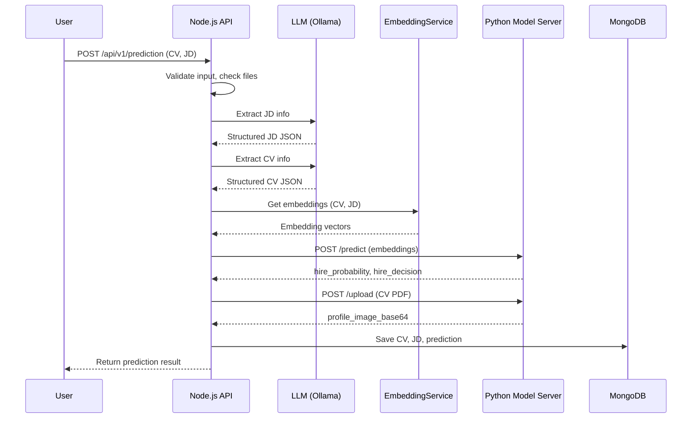

# CV Prediction Process: Extreme Technical Detail

---

## Overview

The CV prediction process in CV Screen is a multi-stage pipeline that takes a candidate's CV (and a job description), processes them through several AI and data extraction steps, and returns a detailed prediction of candidate-job fit, including similarity scores and a hire probability/decision. This process involves both the Node.js/TypeScript backend and a Python model server.

---

## High-Level Data Flow Diagram

```mermaid
graph TD
  A[API Request: /prediction] --> B[Prediction Controller]
  B --> C[Prediction Service]
  C --> D[PredictorService]
  D --> E[PDF Reader]
  D --> F[ExtractorService (LLM)]
  D --> G[Transformer]
  D --> H[EmbeddingService]
  D --> I[Python Model Server]
  D --> J[Image Extraction]
  D --> K[Cosine Similarity]
  D --> L[MongoDB: Save Results]
  L --> M[API Response]
```

---

## 1. API Endpoint: `/prediction`

- **Route:** `POST /api/v1/prediction/`
- **Controller:** `makePrediction` in `src/modules/prediction/prediction.controller.ts`
- **Request Body Type:**
  ```ts
  interface IPredictionRequest {
    cvFileName: string;
    jdFileName?: string;
    jdText?: string;
  }
  ```
- **Authentication:** Not required for single prediction (required for multi)

---

## 2. Controller Layer

- **File:** `src/modules/prediction/prediction.controller.ts`
- **Function:** `makePrediction`
- **Responsibilities:**
  - Logs request start/end
  - Calls `Prediction.makePrediction`
  - Handles errors and sends response

---

## 3. Service Layer: `Prediction.makePrediction`

- **File:** `src/modules/prediction/prediction.service.ts`
- **Function:** `makePrediction`
- **Responsibilities:**
  - Validates input (checks file existence, required fields)
  - Calls `PredictorService.predict`
  - Saves extracted JD and CV data to MongoDB
  - Saves prediction result to MongoDB
  - Returns structured response

**Validation Example:**
```ts
if (!cvFileName) throw createBadRequest('cvFileName is required');
if (!jdFileName && !jdText) throw createBadRequest('jdFileName or jdText is required');
```

---

## 4. Core Prediction Pipeline: `PredictorService.predict`

- **File:** `src/shared/services/predictor.service.ts`
- **Class:** `PredictorService`
- **Method:** `predict(cvPaths, jdTextOrPath, isJDPath)`

### Step-by-Step Breakdown

#### a. Read and Extract JD
- If `isJDPath` is true, reads JD PDF using `readPdf` (uses `pdf-parse`)
- Sends JD text to `ExtractorService.extractFromJD` (calls LLM via Ollama)
- LLM returns structured JD object (parsed JSON)
- Validates extraction (must have `jobTitle`)
- Prepares JD text for embedding using `Transformer.prepareJDTextForEmbedding`
- Generates JD embeddings using `EmbeddingService.getAverageEmbedding` and `getEmbedding`

#### b. For Each CV File
- Reads CV PDF using `readPdf`
- Sends CV text to `ExtractorService.extractFromCV` (calls LLM via Ollama)
- LLM returns structured CV object (parsed JSON)
- Validates extraction (must have `personalInfo`)
- Prepares CV text for embedding using `Transformer.prepareCVTextForEmbedding`
- Generates multiple embeddings:
  - Combined, technical, education, work experience, and raw text
- Calculates cosine similarity between each CV embedding and JD embedding

#### c. AI Hire Prediction (Python Model Server)
- Combines raw CV and JD embeddings into a single array
- Sends POST request to Python server `/predict` endpoint:
  ```json
  { "embedding": [ ...rawCvEmbed, ...rawJdEmbedding ] }
  ```
- Python server loads `hire_prediction_model.pkl` (scikit-learn model)
- Predicts:
  - `hire_probability` (float)
  - `hire_decision` (0 or 1)
- Returns results to Node.js backend

#### d. Profile Image Extraction
- Sends CV PDF to Python server `/upload` endpoint (multipart/form-data)
- Python server extracts images, detects faces (OpenCV)
- If a face is found, returns base64-encoded image string
- Node.js backend stores image with CV data

#### e. Result Assembly
- Gathers all similarity scores, extracted data, prediction, and image
- Returns structured result for each CV

---

## 5. Data Structures and Types

### Prediction Request/Response
```ts
interface IPredictionRequest {
  cvFileName: string;
  jdFileName?: string;
  jdText?: string;
}

interface IPredictionResponse {
  extractedJD: IJd;
  result: {
    cosineSimilarity: ICosineSimilarity[];
    extractedCv: ICv;
    cvId: string;
    jdId: string;
    predictionId: string;
    image?: string;
  }[];
}
```

### CV and JD Types (Simplified)
```ts
interface ICv { ... }
interface IJd { ... }
interface ICosineSimilarity {
  total?: number;
  technical?: number;
  education?: number;
  workExp?: number;
  raw?: number;
  hireProbability?: number;
  hireDecision?: number;
}
```

---

## 6. Inter-Service Communication

### Node.js <-> Python Model Server
- **/predict:** Receives embeddings, returns hire probability/decision
- **/upload:** Receives PDF, returns profile image (if face detected)
- **Protocol:** HTTP (JSON for /predict, multipart/form-data for /upload)
- **Error Handling:**
  - Node.js checks for missing/invalid responses
  - Python returns error JSON if input is invalid

---

## 7. Embedding and Similarity Calculation

### Embedding
- **Library:** `@xenova/transformers` (MiniLM-L6-v2)
- **How:**
  - Text is passed to the transformer model
  - Model outputs a 384-dimensional vector (list of numbers)
  - Used for both CV and JD

### Cosine Similarity
- **Formula:**
  ```ts
  cosineSimilarity(vec1, vec2) = dot(vec1, vec2) / (||vec1|| * ||vec2||)
  ```
- **Purpose:** Measures how similar two vectors are (1 = identical, 0 = orthogonal)

---

## 8. AI Hire Prediction (Python)

### Model
- **File:** `model-server/app/model.py`
- **Model:** Trained scikit-learn classifier (e.g., Logistic Regression)
- **Input:** 768-dimensional vector (384 from CV + 384 from JD)
- **Output:**
  - `hire_probability`: Probability of hire (float)
  - `hire_decision`: 0 (no hire) or 1 (hire)

### Endpoint Example
```python
@predict_bp.route("/predict", methods=["POST"])
def predict():
    data = request.get_json()
    embedding = data["embedding"]
    prob, decision = predict_embedding(embedding)
    return jsonify({"hire_probability": round(prob, 3), "hire_decision": decision})
```

---

## 9. Image Extraction (Python)

- **Extracts images from PDF using PyMuPDF**
- **Detects faces using OpenCV**
- **Returns first detected face as base64 string**

---

## 10. Data Storage (MongoDB)

- **CV Data:** Saved in `cv_data` collection
- **JD Data:** Saved in `jd_data` collection
- **Prediction Results:** Saved in `prediction` collection
- **Schemas:** Strictly defined with Mongoose

---

## 11. Error Handling and Validation

- **Input validation:** Checks for required fields, file existence
- **Extraction validation:** Ensures LLM returns required fields
- **Model server errors:** Caught and logged; fallback values if model fails
- **Database errors:** Caught and returned as internal errors

---

## 12. Security at Each Step

- **File upload:** Only PDFs, max 5MB, validated by Multer
- **Authentication:** JWT required for multi-prediction
- **Sensitive data:** Passwords hashed, tokens signed
- **Rate limiting:** Prevents abuse

---

## 13. Sequence Diagram



---

## 14. Example Code Snippets

### Calling the Python Model Server
```ts
const modelResponse = await axios.post(`${config.modelUrl}predict`, {
  embedding: [...rawCvEmbed, ...rawJdEmbedding],
});
```

### Cosine Similarity Calculation
```ts
public cosineSimilarity(vec1: number[], vec2: number[]): number {
  const dot = vec1.reduce((sum, v, i) => sum + v * vec2[i], 0);
  const mag1 = Math.sqrt(vec1.reduce((sum, v) => sum + v * v, 0));
  const mag2 = Math.sqrt(vec2.reduce((sum, v) => sum + v * v, 0));
  return dot / (mag1 * mag2);
}
```

---

## 15. Summary Table: Major Steps

| Step             | Node.js Module/Service         | Python Component   | Data/Type          |
| ---------------- | ------------------------------ | ------------------ | ------------------ |
| Input Validation | prediction.controller/service  | -                  | IPredictionRequest |
| PDF Reading      | fileReader.service             | -                  | string (text)      |
| LLM Extraction   | extractor.service              | Ollama             | Structured JSON    |
| Embedding        | embedding.service              | -                  | number[] (vector)  |
| Similarity       | predictor.service              | -                  | number (0-1)       |
| Hire Prediction  | predictor.service (axios)      | model.py           | float, int         |
| Image Extraction | extractor.service (axios)      | image_extractor.py | base64 string      |
| Data Storage     | cvData/jdData/prediction.model | -                  | MongoDB documents  |

---

**End of Detailed CV Prediction Process** 